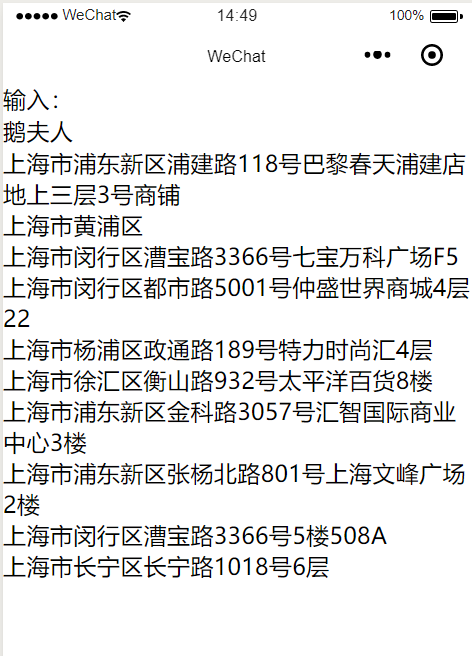

# 微信小程序基本控件集合

#### canvas_poster : 微信小程序 - canvas 绘制图片，生成临时文件保存到相册

#### equipment_audio_record : 微信小程序 - 录音设备封装控件

- ./record_page/record.js 源文件
- ./record_page/use_record.js 引用示例
- 测试

#### map_search_place : qq 地理位置查询 jssdk

- ./utils/qqmap-wx-jssdk.min.js
- 引用需要 appKey ***，提供一个自己使用的测试；服务来源腾讯地图服务

#### map_location : 微信地图定位

- map 修改标签属性可直接进行定位，标记等操作
- 模拟器位置不准，使用手机预览

#### qrcode : 微信扫描二维码

- 无需引用第三方插件，直接支持